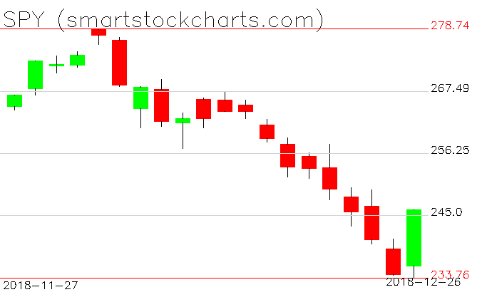

# Stockchart: minimalist stock charts

This is the program I wrote for plotting the stock charts on [my investment blog](https://smartstockcharts.com).  I searched long and hard on Github for an easy to use stock charting program but couldn't find one so I created my own.  This one requires just 3 major libraries:

- Numpy
- Pandas
- Opencv


## Installation

To get started, just install these libraries via conda:

``` conda install numpy pandas opencv ```

or pip:

``` pip install numpy pandas opencv ```

Then download and install the package:

``` git clone https://github.com/xjdeng/stockchart ```

``` cd stockchart ```

``` pip install -U . ```


## Running

First, download some historical stock prices from Yahoo, [like this one](https://finance.yahoo.com/quote/SPY/history?p=SPY).  Save it as SPY.csv in your working directory.

Next, run the following:

```import stockchart```

```spy = stockchart.load_yahoo_csv("SPY.csv")```

``` chart = stockchart.defaultChart(spy) ```

```stockchart.show(chart)```

(Be sure to hit the space bar when you're done viewing the chart.)

And you'll see something like this:



## Parameters

To make the program lean and easy to get started, I didn't include many features, just the bare minimum that I need to manipulate on a regular basis.  If you'd like new features, feel free to fork my repository and add the features you'd like.

### Main function: defaultChart():

#### Parameter 1 (required): stock

This parameter contains the stock you want to plot loaded as a Pandas dataframe.  You must format the dataframe in the following way:

- Open prices need to be in a column named *open* or *Open*
- High prices in a column named *high* or *High*
- Low prices in a column named *low* or *Low*
- Closing prices in a column named *close* or *Close*

#### Parameter 2 (optional): height

This is the **approximate** height of the main portion of the chart.  The chart will actually be a little higher due to the addition of headers and footers.  The default setting is 350 pixels.

#### Parameter 3 (optional): width

This is the **approximate** width of the main portion of the chart.  The final chart will also be a little wider than this width.  The default setting is 600 pixels.

#### Parameter 4 (optional): upbull

If you set this to 1, the top line and label will be green.  If you set this to 0, then it'll be red.  If you set this to None (default), it'll be gray

#### Parameter 5 (optional): downbull

If you set this to 1, the bottom line and label will be green.  If you set this to 0, then it'll be red.  If you set this to None (default), it'll be gray

#### Parameter 6 (optional): headtext

This is the text that'll appear at the top of the chart.